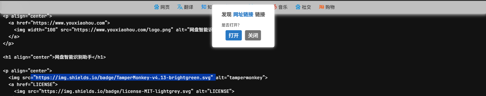

<h1 align="center">链接智能识别助手</h1>

  
  
  
  
  

  <strong>👉 自动识别网盘分享链接并填写提取码 👈</strong> 
  适用于 Linux，macOS，Windows 平台

>引用自[网盘智能识别助手](https://www.youxiaohou.com/tool/install-panai.html#%F0%9F%92%AF-%E5%B8%B8%E8%A7%81%E9%97%AE%E9%A2%98)的介绍：
>
>【网盘智能识别助手】可以智能识别网页中选中文字（一般背景为蓝色）里的 网盘链接 和 提取码/密码，提示并自动填写提取码。
>
>目前已支持识别：`✅百度网盘` `✅阿里云盘` `✅腾讯微云` `✅蓝奏云` `✅天翼云盘` `✅和彩云` `✅迅雷云盘` `✅123云盘` `✅360云盘` `✅115网盘` `✅奶牛快传` `✅城通网盘` `✅夸克网盘` `✅Chrome 扩展商店` `✅Edge 扩展商店` `✅Firefox 扩展商店`（安装成功后可以使用页尾的链接进行测试）**识别速度小于 1 毫秒**。

在此基础上添加了识别`普通链接`（非网盘链接）的功能

## 截图

## BUG

- [ ] 部分时候识别错误

- [ ] 优化代码逻辑

- [ ] 优化文本
